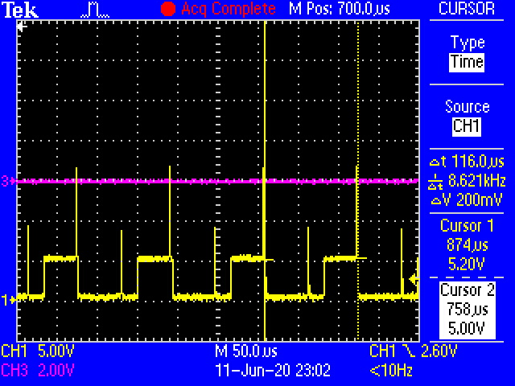
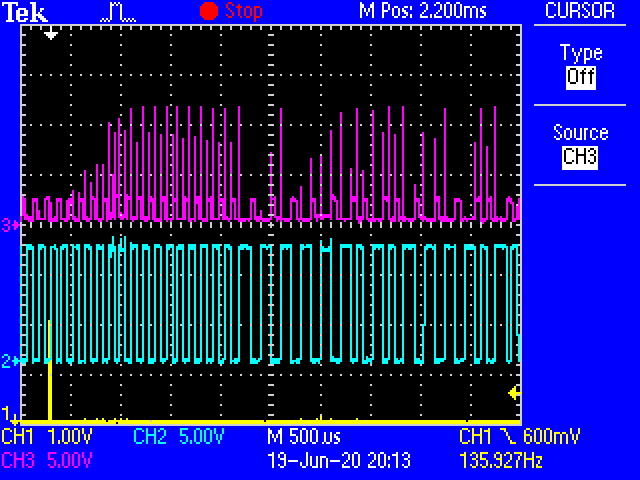
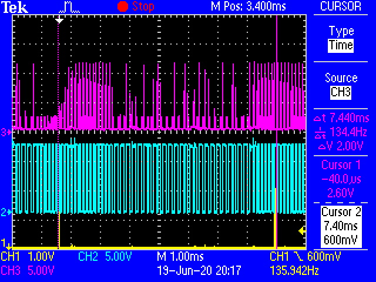
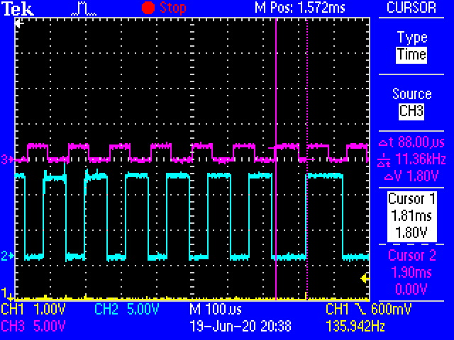

# single_byte.jpg #

This shows a single byte being output, following the DCC protocol.

The byte: `11101001`

# gate_level.jpg #

This shows the the individual levels of the mosfet gates as the they toggle

# one.jpg #

a `one` bit

# zero.jpg #

a `zero` bit

# SHIFTTIME.jpg #

This shows the periodic delay from the shifts. This made errors pop up many times

# SHIFTTIME2.jpg #

This shows the state of affairs once I replaced the shift with mask array

# receiver_interrupt.JPG #

The time of the edge interrupt of the receiver. The cursor shows the period, it was receiving a stream of ones

# preamble.JPG #

Shows the preambe of a packet

# receiver_interrupt2(8MHz).JPG #
.JPG)

A better displayed reciever interrupt, running at 8MHz

# receiver_interrupt(4MHz).JPG #
.JPG)

receiver running at 4 MHz (via state button)

# FullPacket.JPG #

A packet fully displayed

# transmitter_interrupt.JPG #

Timing of transmit interrupt

