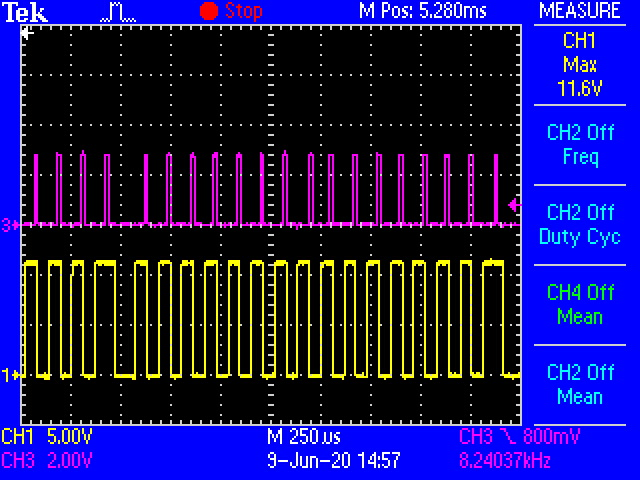

# single_byte.jpg #

This shows a single byte being output, following the DCC protocol.

The byte: `11101001`

# gate_level.jpg #

This shows the the individual levels of the mosfet gates as the they toggle

# one.jpg #

a `one` bit

# zero.jpg #

a `zero` bit

# SHIFTTIME.jpg #

This shows the periodic delay from the shifts. This made errors pop up many times

# SHIFTTIME2.jpg #

This shows the state of affairs once I replaced the shift with mask array